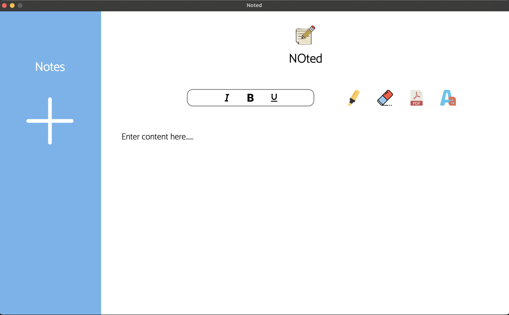

<h1 align="center"> NOted</h1>

An Electron.js App made for the purpose of note taking.NOted allows you create notes to save for later and customize them in a variety of ways.NOted is an Open-Source App.

   

  
        
        
  

    

        
    

  

